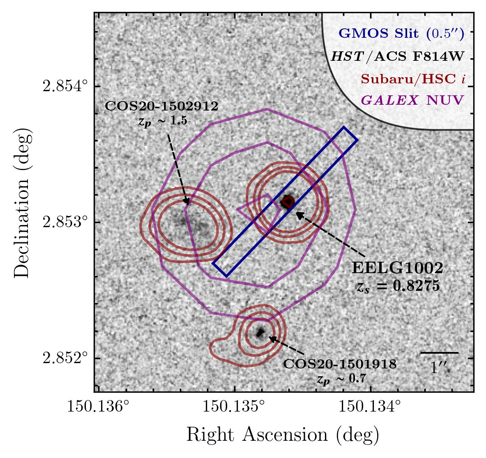
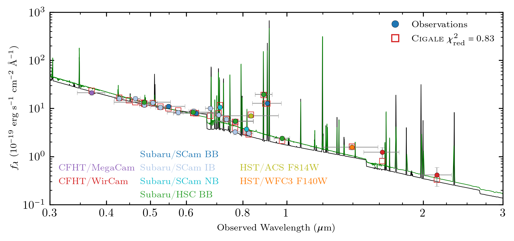

# EELG1002 -- A Unique Extreme Emission Line Galaxy

  

  

**Welcome to our repository focused on EELG1002**: a z = 0.8275 extreme emission line galaxy identified in archival Gemini/GMOS data (PI: Kiyoto Yabe) as part of on-going work on the COSMOS Spectroscopic archive.

The paper draft for associated in this repository is found within "paper/" and it has been submitted to The Astrophysical Journal for peer-review.

This repository is meant to be a resource for anyone interested in looking with closer detail on what went in our measurements and also for reproducing our results. 

All of the raw spectra were reduced with a older development branch of [Pypeit](https://pypeit.readthedocs.io/en/stable/) focused on Gemini/GMOS mask ingestion (v1.10 development). This has since been incorporated in the main Pypeit release.

## Main Dependencies to Get Everything Running
1. [Bagpipes](https://github.com/ACCarnall/bagpipes)  
2. [Cigale](https://gitlab.lam.fr/cigale/cigale)
3. [Pyneb](https://pypi.org/project/PyNeb/)
4. [PyQSOFit](https://github.com/legolason/PyQSOFit)
5. [Pysersic](https://github.com/pysersic/pysersic)
6. [SpecPro](http://specpro.caltech.edu/)
