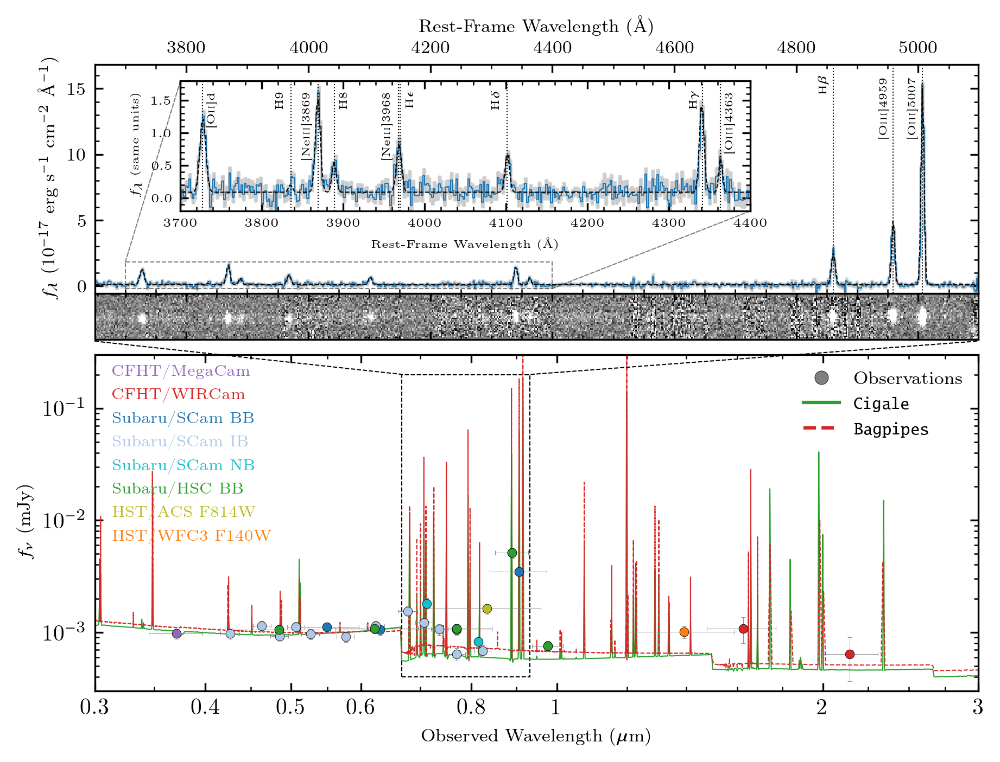

# EELG1002
<i>A Unique z ~ 0.8 Extreme Emission Line Galaxy similar to Early Universe Galaxies</i>

  
  

**Welcome to our repository focused on EELG1002**: a z = 0.8275 extreme emission line galaxy identified in archival Gemini/GMOS data (PI: Kiyoto Yabe) as part of on-going work on the COSMOS Spectroscopic archive.

The paper draft associated with this repository is found within "paper/" and has been accepted for publication in The Astrophysical Journal.

This repository is meant to be a resource for anyone interested in taking a closer look at our process in making our measurements and also for reproducing our results. 

All of the raw spectra were reduced with an older development branch of [Pypeit](https://pypeit.readthedocs.io/en/stable/) focused on Gemini/GMOS mask ingestion (v1.10 development). This has since been incorporated in the main Pypeit release.

## Main Dependencies to Get Everything Running
1. [Bagpipes](https://github.com/ACCarnall/bagpipes)  
2. [Cigale](https://gitlab.lam.fr/cigale/cigale)
3. [Pyneb](https://pypi.org/project/PyNeb/)
4. [PyQSOFit](https://github.com/legolason/PyQSOFit)
5. [Pysersic](https://github.com/pysersic/pysersic)
6. [SpecPro](http://specpro.caltech.edu/)

## Questions, Comments, Suggestions
Feel free to reach out by opening an [issue](https://github.com/akhostov/EELG1002/issues) for open discussion or reach me: Ali Ahmad Khostovan -- akhostov [at] gmail [dot] com

## License
Shield: [![CC BY 4.0][cc-by-shield]][cc-by]

This work is licensed under a
[Creative Commons Attribution 4.0 International License][cc-by].

[![CC BY 4.0][cc-by-image]][cc-by]

[cc-by]: http://creativecommons.org/licenses/by/4.0/
[cc-by-image]: https://i.creativecommons.org/l/by/4.0/88x31.png
[cc-by-shield]: https://img.shields.io/badge/License-CC%20BY%204.0-lightgrey.svg
